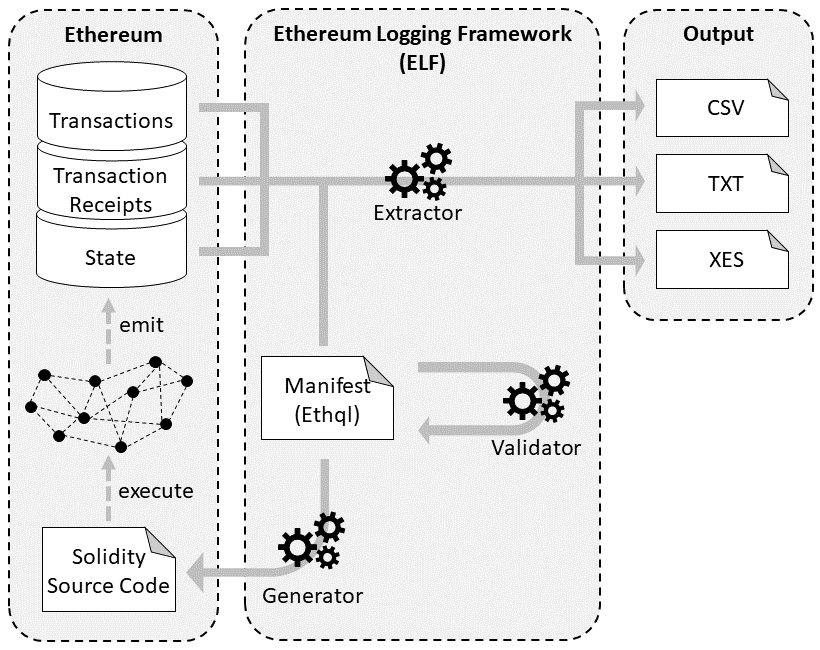

# Blockchain Logging Framework

<!-- [](https://elf-ci.rohrschacht.de/job/BLF)  -->
[](https://github.com/TU-ADSP/Blockchain-Logging-Framework/actions?query=workflow%3A%22Java+CI+with+Maven%22) 
<!-- [](https://elf-sonar.rohrschacht.de/dashboard?id=au.csiro.data61.aap%3Aelf)  -->

<!-- [](https://elf-sonar.rohrschacht.de/dashboard?id=au.csiro.data61.aap%3Aelf) [](https://elf-sonar.rohrschacht.de/dashboard?id=au.csiro.data61.aap%3Aelf) [](https://elf-sonar.rohrschacht.de/dashboard?id=au.csiro.data61.aap%3Aelf) [](https://elf-sonar.rohrschacht.de/dashboard?id=au.csiro.data61.aap%3Aelf) [](https://elf-sonar.rohrschacht.de/dashboard?id=au.csiro.data61.aap%3Aelf) [](https://elf-sonar.rohrschacht.de/dashboard?id=au.csiro.data61.aap%3Aelf) [](https://elf-sonar.rohrschacht.de/dashboard?id=au.csiro.data61.aap%3Aelf) [](https://elf-sonar.rohrschacht.de/dashboard?id=au.csiro.data61.aap%3Aelf) [](https://elf-sonar.rohrschacht.de/dashboard?id=au.csiro.data61.aap%3Aelf) [](https://elf-sonar.rohrschacht.de/dashboard?id=au.csiro.data61.aap%3Aelf) -->

## Documentation

Please visit the [javadoc](https://tu-adsp.github.io/BLF-Javadoc/master/index.html) documentation for more information.

This framework provides advanced logging capabilities for Ethereum applications on top of Web3J / Ethereum's JSON RPC. It consists of four components:

- BcQL: a query language for data on blockchains
- Validator: a component to check bcql documents for specification erros
- Extractor: a component to extract, transform and format data based on bcql
- Generator: a component to create efficient logging functionality that can be embedded into smart contracts



Example bcql documents include
- [AugurContractRegistry.bcql](./src/main/resources/AugurContractRegistry.bcql)
- [CryptoKitties.bcql](./src/main/resources/CryptoKitties.bcql)
- [GeneratorShirtExample.bcql](./src/main/resources/GeneratorGitExample.bcql)
- [GeneratorGitExample.bcql](./src/main/resources/GeneratorShirtExample.bcql)
- [NetworkStatistics.bcql](./src/main/resources/NetworkStatistics.bcql)
- Scripts contributed by Hendrik Bockrath
  - [Bockrath_Forsage.bcql](./src/main/resources/Bockrath_Forsage.bcql)
  - [Bockrath_Raiden.bcql](./src/main/resources/Bockrath_Raiden.bcql)
- Scripts contributed by Martin Rebesky
  - [Rebesky_Augur.bcql](./src/main/resources/Rebesky_Augur.bcql)
  - [Rebesky_ChickenHunt.bcql](./src/main/resources/Rebesky_ChickenHunt.bcql)
  - [Rebesky_Idex1.bcql](./src/main/resources/Rebesky_Idex1.bcql)
  - [Rebesky_Idex2.bcql](./src/main/resources/Rebesky_Idex2.bcql)
  - [Rebesky_Idex3.bcql](./src/main/resources/Rebesky_Idex3.bcql)

Code demonstrating the use of the component scan be found here
- [Validator](src/main/java/blf/samples/ValidatorTest.java)
- [Extractor](src/main/java/blf/samples/ExtractorTest.java)
- [Generator](src/main/java/blf/samples/GeneratorTest.java) (the generated code has been tested with Solidity 0.5.10)

## Publications

Details of the framework are described in more detail in the following publication:

[C. Klinkmüller, A. Ponomarev, A.B. Tran, I. Weber, W. van der Aalst (2019)](https://www.researchgate.net/publication/335399009_Mining_Blockchain_Processes_Extracting_Process_Mining_Data_from_Blockchain_Applications): "Mining Blockchain Processes: Extracting Process Mining Data from Blockchain Applications". In: 17th International Conference on Business Process Management (Blockchain Forum).

[C. Klinkmüller, I. Weber, A. Ponomarev, A.B. Tran, W. van der Aalst (2020)](https://arxiv.org/abs/2001.10281): Efficient Logging for Blockchain Applications. 	arXiv:2001.10281.

## Short video demonstration 

https://user-images.githubusercontent.com/17274966/121722525-d7191980-cae5-11eb-8291-900e030beea5.mp4

## Build

1. Ensure Java 11 or higher is installed locally and the env var `JAVA_HOME` is properly set. [AdoptOpenJDK](https://adoptopenjdk.net/installation.html) provides binaries and installation guides for various operating systems.

2. Install Apache Maven. Distribution archive and installation guidelines are available at [maven.apache.org](https://maven.apache.org/index.html).

3. To check whether Java and Maven have been set up correctly, run
    ```bash
    mvn --version
    ```
4. To build the project, run
    ```bash
    cd Blockchain-Logging-Framework
    mvn clean verify
    ```
    - To not build the executable jar ```blf-cmd.jar```, add the option
      ```bash
      "-Dblf.skip.assemble=true"
      ``` 
    - To skip testing, add the option
      ```bash
      "-DskipTests"
      ``` 

Now you're ready to develop!

## Test

To run unit tests, run
```bash
mvn test
```
## Enable Git Hooks

```bash
 git config --local core.hooksPath .githooks/
 chmod u+x .githooks/pre-commit
```

## License

This software is released under the MIT Licence Agreement. Details can be found [LICENSE.md](LICENSE.md). Moreover the third party components distributed with the software and their licenses are listed in [NOTICE.md](NOTICE.md).


